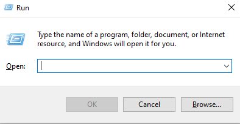

# Instructions to fix the gnu plot issue. 

## section-1 (Let's check gnuplot is installed or not)
1. Press <kbd>Win</kbd> + <kbd>R</kbd> to open the Run dialog. You will see a window in the bottom left corner of your screen, like the following, 

2. Type `gnuplot` in the box and press **Enter**.
